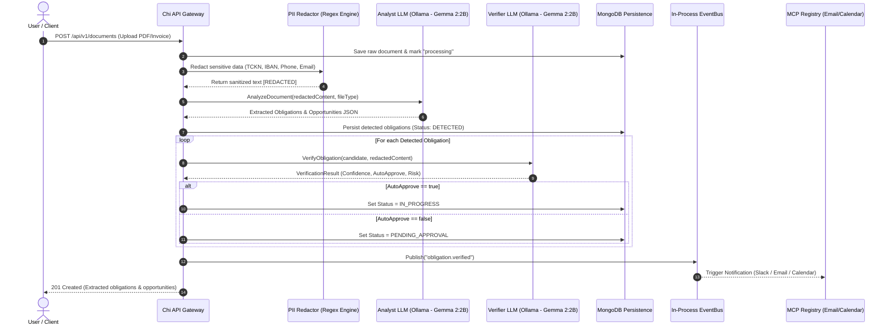

# ClaimPilot — Low Level Architecture (LLA) Specification

> **Document Version:** 1.0.0  
> **Status:** Production / Active  
> **Target Audience:** Core Engineers, Solution Architects, Technical Auditors  
> **Repository:** `Gurkan26/claimpilot`  

---

## 1. Executive Architecture Summary

ClaimPilot is an enterprise-grade autonomous AI employee platform designed for corporate and personal obligation lifecycle management. The backend is implemented in **Go 1.26+** utilizing **Clean / Hexagonal Architecture** with **Domain-Driven Design (DDD)** bounded contexts. The frontend is built as a cross-platform desktop application utilizing **Electron, React 18, TypeScript, and Vite**.

The system orchestrates multi-agent workflows (Analyst, Verifier, RFQ Marketplace Engine), enforces zero-leak data privacy via an in-process **PII Redaction Engine**, interacts with external services through **Model Context Protocol (MCP)** adapters, and maintains an immutable audit log.

```
+-----------------------------------------------------------------------------------+
|                            PRESENTATION LAYER                                     |
|  +--------------------------------+   +----------------------------------------+  |
|  | Electron Desktop (React 18/TS) |   | Terminal REPL (cmd/spark Go CLI)       |  |
|  +--------------------------------+   +----------------------------------------+  |
+------------------------------------------|----------------------------------------+
                                           | HTTP/REST / GraphQL / WebSockets
+------------------------------------------v----------------------------------------+
|                            INFRASTRUCTURE / GATEWAY                               |
|  +-----------------------------------------------------------------------------+  |
|  | Chi HTTP Router | CORS | Auth JWT | In-Memory EventBus | GraphQL Playground |  |
|  +-----------------------------------------------------------------------------+  |
+------------------------------------------|----------------------------------------+
                                           | Invokes
+------------------------------------------v----------------------------------------+
|                            APPLICATION LAYER (USE CASES)                         |
|  +-------------------+  +---------------------+  +------------------------------+ |
|  | DocumentUploadUC  |  | ApproveObligationUC |  | TriggerRFQUseCase            | |
|  | DashboardSummaryUC|  | DismissObligationUC |  | HarnessUseCase (Admin)       | |
|  +-------------------+  +---------------------+  +------------------------------+ |
+------------------------------------------|----------------------------------------+
                                           | Coordinates
+------------------------------------------v----------------------------------------+
|                            AGENT & ORCHESTRATION LAYER                            |
|  +-----------------------------------------------------------------------------+  |
|  |                       Orchestrator Pipeline                                 |  |
|  |   [PII Redactor] -> [Analyst Agent] -> [Verifier Agent] -> [RFQ Engine]     |  |
|  +-----------------------------------------------------------------------------+  |
|  | Hot-Swappable LLM Providers: Groq, Ollama, OpenAI, Anthropic, Go-Builtin    |  |
|  +-----------------------------------------------------------------------------+  |
+------------------------------------------|----------------------------------------+
                                           | Dispatches Tools & Persists
+------------------------------------------v----------------------------------------+
|                            DOMAIN & DATA ACCESS LAYER                             |
|  +----------------------------------+   +--------------------------------------+  |
|  | Pure Domain Models & Interfaces  |   | MCP Adapters (Gmail, Calendar, Slack)|  |
|  | (Document, Obligation, Mkt, Audit|   +--------------------------------------+  |
|  +----------------------------------+   | Persistence: MongoDB (Documents,     |  |
|                                         | Obligations, Marketplace, Audit Logs)|  |
|                                         +--------------------------------------+  |
+-----------------------------------------------------------------------------------+
```

---

## 2. Directory & Package Structure

```
claimpilot/
├── backend/
│   ├── cmd/
│   │   ├── api/                  # Main HTTP/REST & GraphQL Server Entrypoint
│   │   ├── spark/                # Interactive Terminal CLI Application
│   │   ├── worker/               # 24/7 Background Due-Date Scanner Daemon
│   │   └── server/               # PostgreSQL Monolith Engine (Legacy/Multi-tenant)
│   └── internal/
│       ├── agent/
│       │   ├── analyst/          # Document semantic parser & extraction agent
│       │   ├── verifier/         # Cross-check verification & risk scoring agent
│       │   ├── marketplace/      # Autonomous RFQ & supplier bidding engine
│       │   ├── orchestrator/     # Core pipeline coordinator
│       │   └── llmclient/        # Dynamic provider interface (Groq, Ollama, etc.)
│       ├── application/
│       │   ├── admin/usecase/    # Agent harness configuration & simulation
│       │   ├── dashboard/usecase/# KPI calculation & telemetry aggregation
│       │   ├── document/usecase/ # Document ingest, parsing & storage flows
│       │   ├── marketplace/usecase/# RFQ triggers, bid evaluation & acceptance
│       │   └── obligation/usecase/# Obligation approval, dismissal & listing
│       ├── domain/
│       │   ├── audit/model/      # Immutable audit trail domain structures
│       │   ├── document/         # Document models, parser & storage interfaces
│       │   ├── marketplace/model/# Opportunities, supplier bids & money models
│       │   └── obligation/model/ # Obligations, statuses, risk levels & agent outputs
│       ├── infrastructure/
│       │   ├── http/handler/     # Chi REST endpoints (document, obligation, mkt, admin)
│       │   ├── graphql/          # GraphQL schema & query/mutation resolvers
│       │   ├── mongodb/          # MongoDB repository implementations
│       │   └── websocket/        # Real-time event subscription hub
│       ├── mcp/                  # Model Context Protocol Engine
│       │   ├── calendar/         # Google Calendar sync adapter
│       │   ├── deepwiki/         # DeepWiki SSE agent knowledge adapter
│       │   ├── gmail/            # Gmail notification & draft adapter
│       │   └── slack/            # Slack webhook / bot communication adapter
│       ├── pii/                  # Zero-leak regex redaction engine (KVKK/GDPR)
│       └── shared/               # Config loaders, logging, event bus, errors
└── frontend/
    ├── electron/                 # Electron main & preload IPC context bridges
    └── src/
        ├── components/           # UI Views (Dashboard, Obligations, Marketplace, Admin)
        ├── context/              # AuthContext (B2B Corporate vs B2C Personal mode)
        ├── services/             # Axios/Fetch API client & offline store
        └── i18n/                 # Dual language engine (TR/EN)
```

---

## 3. Core Domain Entities & Schemas

### 3.1 Obligation Model (`internal/domain/obligation/model/obligation.go`)
```go
type ObligationType string

const (
    ObligationTypeRenewal      ObligationType = "RENEWAL"
    ObligationTypePayment      ObligationType = "PAYMENT"
    ObligationTypeReport       ObligationType = "REPORT"
    ObligationTypeWarranty     ObligationType = "WARRANTY"
    ObligationTypeCancellation ObligationType = "CANCELLATION"
    ObligationTypeCompliance   ObligationType = "COMPLIANCE"
)

type RiskLevel string

const (
    RiskLevelLow      RiskLevel = "LOW"
    RiskLevelMedium   RiskLevel = "MEDIUM"
    RiskLevelHigh     RiskLevel = "HIGH"
    RiskLevelCritical RiskLevel = "CRITICAL"
)

type Obligation struct {
    ID                       bson.ObjectID    `bson:"_id,omitempty" json:"id"`
    UserID                   uuid.UUID        `bson:"user_id" json:"user_id"`
    OrganizationID           *uuid.UUID       `bson:"organization_id,omitempty" json:"organization_id,omitempty"`
    SourceDocumentID         bson.ObjectID    `bson:"source_document_id" json:"source_document_id"`
    MarketplaceOpportunityID *bson.ObjectID    `bson:"marketplace_opportunity_id,omitempty" json:"marketplace_opportunity_id,omitempty"`
    Type                     ObligationType   `bson:"type" json:"type"`
    Title                    string           `bson:"title" json:"title"`
    Description              string           `bson:"description" json:"description"`
    DueDate                  time.Time        `bson:"due_date" json:"due_date"`
    Status                   ObligationStatus `bson:"status" json:"status"`
    RiskLevel                RiskLevel        `bson:"risk_level" json:"risk_level"`
    AnalystOutput            *AgentOutput     `bson:"analyst_output,omitempty" json:"analyst_output,omitempty"`
    VerifierOutput           *AgentOutput     `bson:"verifier_output,omitempty" json:"verifier_output,omitempty"`
    CreatedAt                time.Time        `bson:"created_at" json:"created_at"`
    UpdatedAt                time.Time        `bson:"updated_at" json:"updated_at"`
}
```

### 3.2 Marketplace Opportunity & Bids (`internal/domain/marketplace/model/`)
```go
type MarketplaceOpportunity struct {
    ID                bson.ObjectID     `bson:"_id,omitempty" json:"id"`
    ObligationID      bson.ObjectID     `bson:"obligation_id" json:"obligation_id"`
    UserID            uuid.UUID         `bson:"user_id" json:"user_id"`
    OrganizationID    *uuid.UUID        `bson:"organization_id,omitempty" json:"organization_id,omitempty"`
    Category          string            `bson:"category" json:"category"`
    CurrentVendorName string            `bson:"current_vendor_name" json:"current_vendor_name"`
    CurrentVendorCost *Money            `bson:"current_vendor_cost" json:"current_vendor_cost"`
    Status            OpportunityStatus `bson:"status" json:"status"`
    Bids              []MarketplaceBid  `bson:"bids" json:"bids"`
    AcceptedBidID     *bson.ObjectID    `bson:"accepted_bid_id,omitempty" json:"accepted_bid_id,omitempty"`
    CreatedAt         time.Time         `bson:"created_at" json:"created_at"`
    UpdatedAt         time.Time         `bson:"updated_at" json:"updated_at"`
}

type MarketplaceBid struct {
    ID            bson.ObjectID `bson:"_id,omitempty" json:"id"`
    VendorName    string        `bson:"vendor_name" json:"vendor_name"`
    VendorWebsite string        `bson:"vendor_website" json:"vendor_website"`
    Price         Money         `bson:"price" json:"price"`
    SavingsAmount Money         `bson:"savings_amount" json:"savings_amount"`
    SavingsRate   float64       `bson:"savings_rate" json:"savings_rate"`
    Terms         string        `bson:"terms" json:"terms"`
    RiskScore     float64       `bson:"risk_score" json:"risk_score"`
    Verified      bool          `bson:"verified" json:"verified"`
}
```

---

## 4. End-to-End Orchestrator Pipeline Sequence



---

## 5. Model Context Protocol (MCP) Architecture

ClaimPilot implements standard MCP contracts to decouple AI decision logic from external infrastructure operations:

```go
type ActionType string

const (
    ActionTypeSendEmail      ActionType = "send_email"
    ActionTypeCreateEvent    ActionType = "create_calendar_event"
    ActionTypeSendSlack      ActionType = "send_slack_message"
    ActionTypeCancelContract ActionType = "cancel_contract"
    ActionTypeNotify         ActionType = "notify"
)

type Adapter interface {
    Name() string
    Execute(ctx context.Context, action *Action) (*ActionResult, error)
    HealthCheck(ctx context.Context) error
    SupportedActions() []ActionType
}
```

### Registry Workflow:
1. `mcp.Registry` maintains thread-safe registration (`sync.RWMutex`).
2. When an obligation is approved or a vendor contract cancellation is confirmed, the Use Case constructs an `mcp.Action`.
3. The adapter executes external I/O (e.g., Google Calendar API via OAuth2, Slack Webhook, Gmail SMTP).
4. Results and execution tokens are written to `internal/domain/audit` collection for complete non-repudiation.

---

## 6. Zero-Leak PII Sanitization Specification

Before raw contract text touches any network socket or LLM API:
1. **Regular Expression Engines:** Pre-compiled static regex patterns match:
   - **TCKN (Turkish National ID):** 11 digits, Luhn-like validation, masked to `[TCKN_REDACTED]`.
   - **IBAN:** ISO 13616 standard formatting masked to `[IBAN_REDACTED]`.
   - **Credit Card Numbers:** Visa/Mastercard/Amex patterns masked to `[CARD_REDACTED]`.
   - **Phone Numbers:** Turkish (`+90 / 05xx`) and E.164 international formats masked to `[PHONE_REDACTED]`.
   - **Email Addresses:** RFC 5322 compliant regex masked to `[EMAIL_REDACTED]`.
2. **Deterministic String Slicing:** Offsets are ordered in descending sequence and replaced in-memory to prevent index displacement.
3. Raw data is stored solely in local encrypted storage/DB; remote LLMs receive only the redacted representation.
